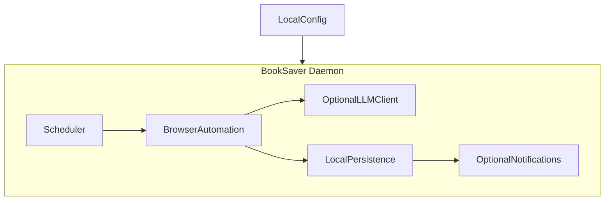

# BookSaver Agent — Project Setup & Documentation Scaffold

Approved plan. Traceability copy stored in `aidlc-docs/plans/`.

## Confirmed Understanding

BookSaver Agent is a **local-first Python daemon** (not a web app). The repository will contain:

- **One Python application** as the main runtime, with internal modules as needed
- **Scheduled background execution** (cron-like or in-process scheduler)
- **Browser automation** for booking checks and possible rebooking
- **Optional LLM API usage** for extraction, reasoning, and page interpretation
- **Local config and local persistence** (no cloud-first architecture)
- **Optional notifications** (email, Telegram, etc.)
- **Modular internal structure** — single process/daemon, not distributed services

### Workflow conventions (this session and beyond)

| Document type | Location |
|---|---|
| Plans (created before work; execution only after your approval) | [`aidlc-docs/plans/`](../plans/) |
| Requirements & feature changes | [`aidlc-docs/requirements/`](../requirements/) |
| User stories | [`aidlc-docs/story-artifacts/`](../story-artifacts/) |
| Architecture & design | [`aidlc-docs/design-artifacts/`](../design-artifacts/) |

All documents are Markdown (`.md`). Separate `frontend/` / `backend/` project folders will not be created unless explicitly requested later.

### Repository state at plan time

- [`README.md`](../../README.md) — project description (travel booking monitor/rebooker daemon)
- [`LICENSE`](../../LICENSE) — MIT
- No `aidlc-docs/` tree (created by this plan)
- No Python application code yet

## Implemented folder structure

```
booksaver-agent/
├── README.md
├── LICENSE
├── aidlc-docs/
│   ├── README.md
│   ├── plans/
│   │   ├── .gitkeep
│   │   └── project-setup-scaffold.md
│   ├── requirements/
│   │   └── .gitkeep
│   ├── story-artifacts/
│   │   └── .gitkeep
│   └── design-artifacts/
│       └── .gitkeep
```

**Intentionally not created yet** (until a future approved plan):

- `src/` or `booksaver/` Python package layout
- `pyproject.toml` / dependency files
- `tests/`
- Separate frontend/backend directories

## What happens after scaffold (future plans)



Example future folders (for reference only):

- `src/booksaver/` — daemon entrypoint, scheduler, modules
- `config/` or `~/.booksaver/` — local config (TBD in design doc)
- `data/` — local SQLite or similar (TBD)

These will be specified in a separate architecture plan in `aidlc-docs/design-artifacts/` before any code is written.

## Out of scope for this plan

- Python package initialization
- Dependency management (`pyproject.toml`, `requirements.txt`)
- CI/CD, pre-commit hooks
- Application code or daemon implementation
