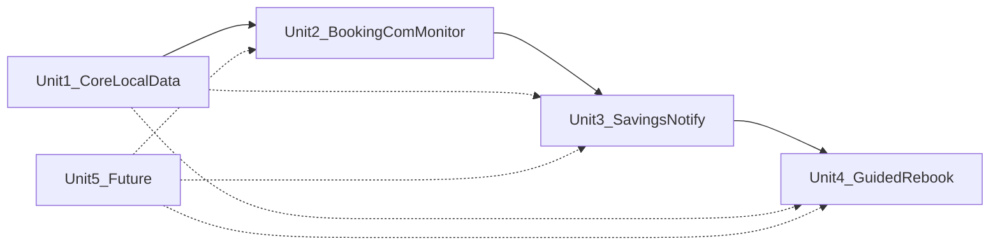

# Units decomposition — execution plan

References: [`../story-artifacts/user-stories-mvp.md`](../story-artifacts/user-stories-mvp.md), [`../requirements/mvp-scope.md`](../requirements/mvp-scope.md)

Granularity: **4 MVP units + 1 Future unit** (`four_plus_future`).

- [x] Create `units_plan.md` with this checklist and locked unit map
- [x] Write [`../design-artifacts/unit-01-core-local-data.md`](../design-artifacts/unit-01-core-local-data.md)
- [x] Write [`../design-artifacts/unit-02-booking-com-monitor.md`](../design-artifacts/unit-02-booking-com-monitor.md)
- [x] Write [`../design-artifacts/unit-03-savings-and-notify.md`](../design-artifacts/unit-03-savings-and-notify.md)
- [x] Write [`../design-artifacts/unit-04-guided-rebook.md`](../design-artifacts/unit-04-guided-rebook.md)
- [x] Write [`../design-artifacts/unit-05-extensibility-future.md`](../design-artifacts/unit-05-extensibility-future.md)
- [x] Verify all 16 stories assigned exactly once; mark plan complete

## Unit map

| Unit | File | Stories | Depends on | Build order |
|------|------|---------|------------|-------------|
| 1 — Core & Local Data | `unit-01-core-local-data.md` | US-001, US-002, US-003, US-013 | None | **1 (first MVP unit)** |
| 2 — Booking.com Price Monitor | `unit-02-booking-com-monitor.md` | US-004, US-005, US-006, US-014 | Unit 1 | 2 |
| 3 — Savings Detection & Notifications | `unit-03-savings-and-notify.md` | US-007, US-008, US-009 | Units 1, 2 | 3 |
| 4 — Guided Rebook | `unit-04-guided-rebook.md` | US-010, US-011, US-012 | Units 1, 2, 3 | 4 |
| 5 — Extensibility (Future) | `unit-05-extensibility-future.md` | US-015, US-016 | Design hooks from Units 1–4 | Post-MVP |

**Cross-cutting:** US-013 (no BookSaver cloud) is owned by Unit 1 and referenced in Units 2–4.

## Story assignment verification

| Story | Unit |
|-------|------|
| US-001 | 1 |
| US-002 | 1 |
| US-003 | 1 |
| US-004 | 2 |
| US-005 | 2 |
| US-006 | 2 |
| US-007 | 3 |
| US-008 | 3 |
| US-009 | 3 |
| US-010 | 4 |
| US-011 | 4 |
| US-012 | 4 |
| US-013 | 1 |
| US-014 | 2 |
| US-015 | 5 |
| US-016 | 5 |

All 16 stories assigned exactly once.
