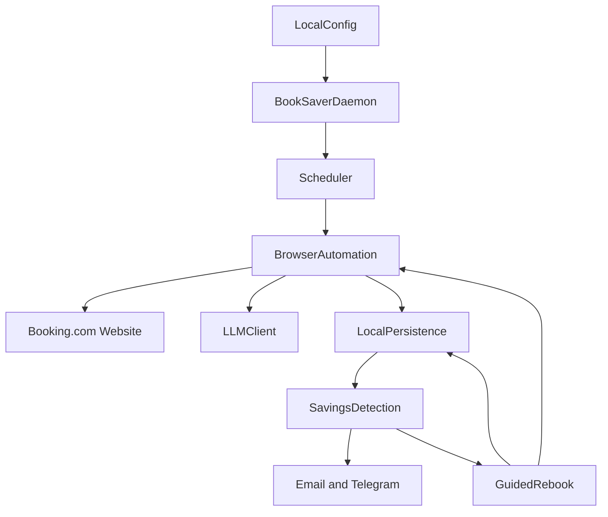

# System Context: BookSaver Agent MVP

## Intent

Build BookSaver Agent as a local-first Python daemon that monitors a user's refundable Booking.com hotel reservation, detects live price drops, notifies the user, and offers a guided rebook flow that always requires explicit human confirmation before any destructive or paid action.

## Actors

- **User:** Individual running the tool locally for themselves or a small trusted circle.
- **Booking.com:** External website reached through browser automation only; no official Booking.com API is used.
- **LLM provider:** User-configured API used for page interpretation when DOM extraction is insufficient.
- **Email provider / Telegram:** User-configured notification channels used directly from the local daemon.

## System Boundary

BookSaver Agent is a single-repository, single-process local daemon. Runtime code, configuration, persistence, browser session data, logs, and audit history stay on the user's machine. The project is explicitly not a web app, hosted backend, multi-tenant SaaS, or frontend/backend split.

## Primary Runtime Collaborators

## Core Constraints

- MVP supports Booking.com hotel bookings only.
- Registered bookings must be refundable.
- A cheaper offer only counts when it has the same property, same check-in/out dates, same room type, and is still refundable.
- Browser automation is used against Booking.com directly; no official travel or Booking.com partner API is in scope.
- LLM-assisted interpretation is required where structured DOM extraction is insufficient.
- There is no autonomous cancel or purchase. Guided rebook always stops for explicit local confirmation before each destructive or paid action.
- No BookSaver-hosted cloud service is required or used. Secrets, sessions, booking data, logs, and history remain local.

## Current Repository State

The repository is documentation/planning only. No Python package, `pyproject.toml`, runtime source tree, dependency files, or tests are created by this migration. Application scaffolding must happen later through an approved specs.md construction plan or bolt.
