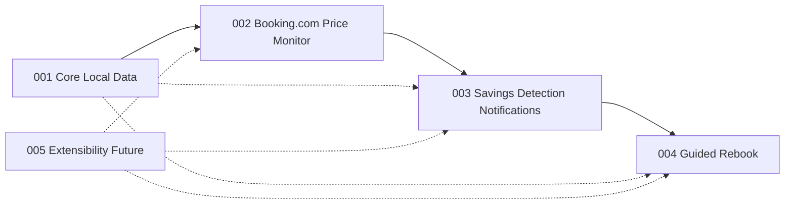

# Units: BookSaver Agent MVP

## Unit Decomposition

BookSaver Agent is decomposed into four MVP units plus one explicit future unit. The build order follows runtime dependencies: local data and lifecycle first, then Booking.com monitoring, then savings/notifications, then guided rebook. Future extensibility is documented as design hooks only until the Booking.com hotel MVP is complete.

| Unit | Responsibility | Stories | Depends On | Build Order | Status |
|------|----------------|---------|------------|-------------|--------|
| `001-core-local-data` | Core & Local Data | US-001, US-002, US-003, US-013 | None | 1 | MVP |
| `002-booking-com-price-monitor` | Booking.com Price Monitor | US-004, US-005, US-006, US-014 | 001-core-local-data | 2 | MVP |
| `003-savings-detection-notifications` | Savings Detection & Notifications | US-007, US-008, US-009 | 001-core-local-data, 002-booking-com-price-monitor | 3 | MVP |
| `004-guided-rebook` | Guided Rebook | US-010, US-011, US-012 | 001-core-local-data, 002-booking-com-price-monitor, 003-savings-detection-notifications | 4 | MVP |
| `005-extensibility-future` | Extensibility | US-015, US-016 | Design hooks from 001-core-local-data through 004-guided-rebook | Post-MVP | Future |
## Cross-Cutting Constraint

US-013, operating without a BookSaver cloud, is owned by `001-core-local-data` and must be honored by all MVP units.

## Completion Gate

All 16 stories from the original inception artifacts are assigned exactly once across these units. MVP construction should start with `001-core-local-data` and defer `005-extensibility-future` until post-MVP work.
