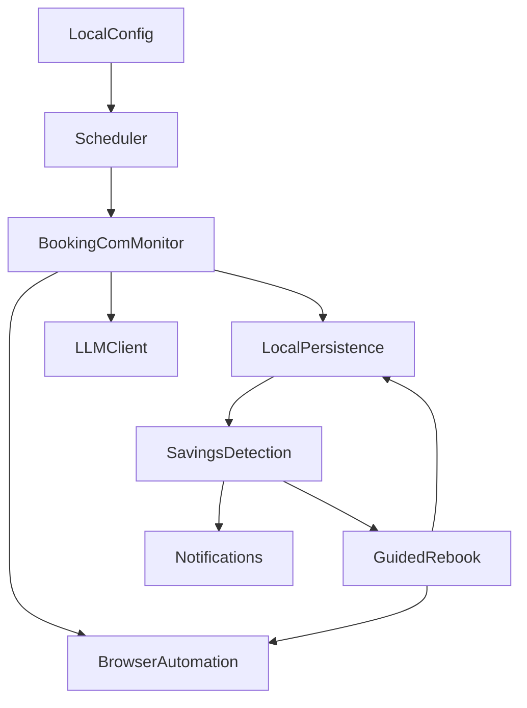

# System Architecture Standards

## Architecture Style

Use a single-process, local-first daemon architecture. Keep components modular inside one Python application rather than introducing distributed services.

## Boundaries

- Booking.com integration happens through browser automation only.
- The LLM is used for extraction and reasoning when DOM parsing is insufficient.
- Notification adapters send directly through the user's configured services.
- Guided rebook must never execute cancel or purchase actions without explicit local confirmation.
- All secrets, sessions, booking data, logs, and check history remain on the user's machine.

## Unit Build Order

1. Core & Local Data
2. Booking.com Price Monitor
3. Savings Detection & Notifications
4. Guided Rebook
5. Extensibility (future only)
